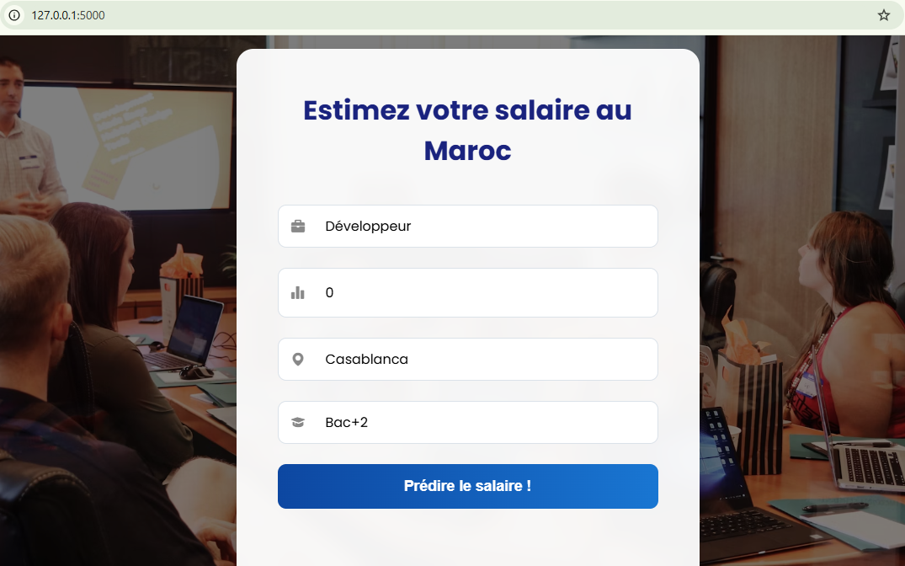

 PFA-PrediSalaire-Maroc

Projet de Fin d'Année (PFA) 2024-2025 ENSA Fès - 1ère Année Cycle Ingénieur Filière : Ingénierie Digitale et Intelligence Appliquée (IDIA)

1. Description du Projet

PrediSalaire Maroc est une application web qui utilise un modèle de Machine Learning pour estimer le salaire mensuel (en DHS) au Maroc.

L'utilisateur entre plusieurs caractéristiques (Poste, Années d'expérience, Ville, Niveau d'études) et l'application renvoie une prédiction basée sur un modèle de Régression Linéaire entraîné sur un jeu de données de salaires.

Ce projet couvre l'ensemble du cycle de vie d'un projet Data/IA :

Collecte de Données (Création d'un dataset)

Entraînement du Modèle IA (Data Preprocessing & Training)

Développement Backend (Création d'une API)

Développement Frontend (Interface utilisateur web)

Déploiement (Mise en service local)

2. Aperçu de l'Application

3. Technologies et Outils Utilisés

Intelligence Appliquée (IA)

Python : Langage principal pour le backend et le modèle.

Scikit-learn : Pour l'entraînement du modèle de Régression Linéaire.

Pandas : Pour le chargement et la préparation des données (Data Preprocessing, One-Hot Encoding).

Joblib : Pour la sauvegarde et le chargement du modèle (.pkl).

Ingénierie Digitale (Web)

Flask : Micro-framework Python pour créer l'API web et servir l'application.

HTML5 : Structure de la page web.

CSS3 : Style et design de l'interface utilisateur.

JavaScript (Fetch API) : Pour communiquer de manière asynchrone entre le Frontend et le Backend.

Outils de Génie Logiciel

Git : Système de contrôle de version.

GitHub : Hébergement du code source.

VS Code : Éditeur de code.

4. Comment Lancer le Projet Localement

Pour tester ce projet sur votre machine, suivez ces étapes :

Prérequis

Python 3.x

Git

Étapes d'Installation

Cloner le dépôt :

git clone [https://github.com/HamzaOraj/PFA-PrediSalaire-Maroc.git](https://github.com/HamzaOraj/PFA-PrediSalaire-Maroc.git)
cd PFA-PrediSalaire-Maroc

Installer les dépendances Python :

pip install pandas scikit-learn flask

Entraîner le modèle (Générer les fichiers .pkl) :
(Cette étape n'est nécessaire que si les fichiers .pkl ne sont pas présents)

python model.py

Lancer l'application web :

python app.py

Ouvrir l'application :
Ouvrez votre navigateur et allez à l'adresse suivante :
http://127.0.0.1:5000